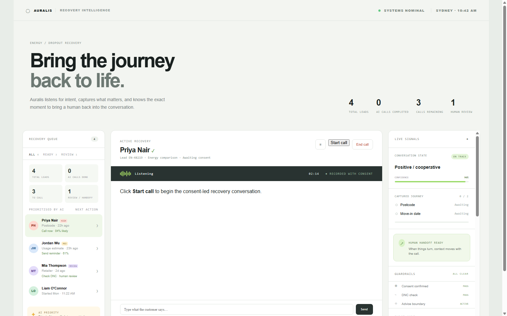
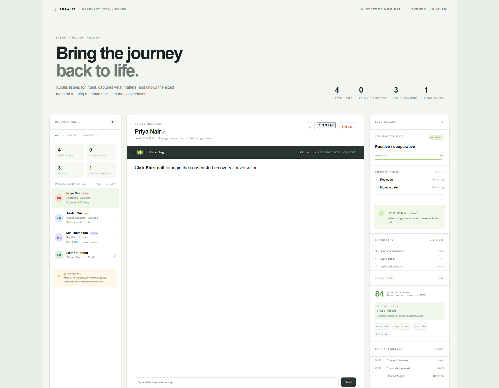
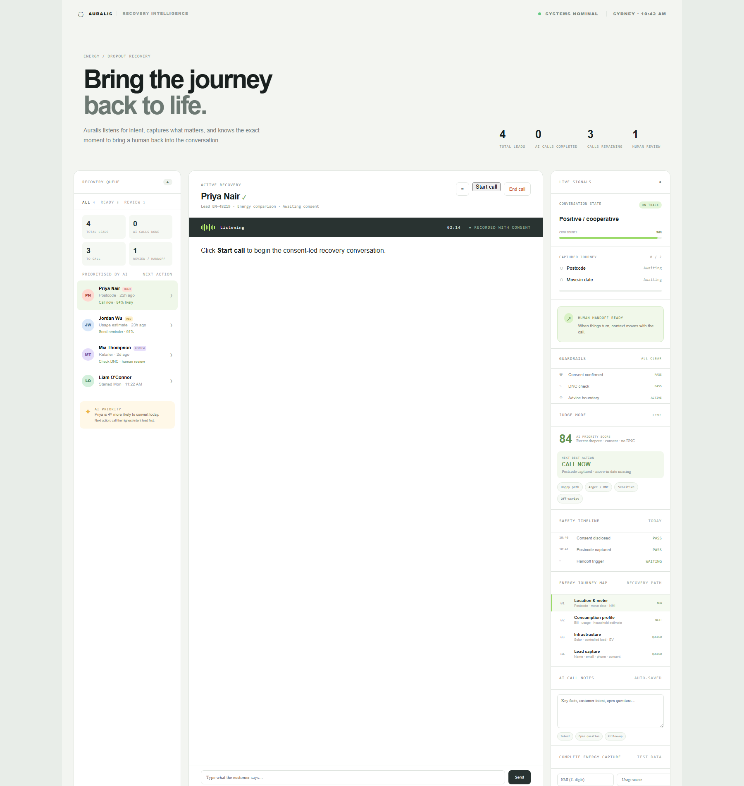
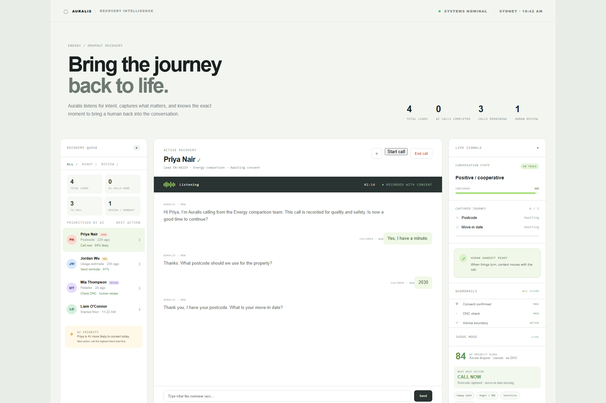

# Auralis — Energy Dropout Recovery Voice Agent

A voice-first, consent-led recovery console for abandoned Australian Energy comparison journeys. It resumes missing fields, captures structured test data, creates live call notes, and stops or escalates safely when required.

## Screenshots









## Highlights

- Four synthetic recovery leads with priority, missing-step context, and next-best action.
- Consent and recording disclosure before data collection.
- Energy flow covering postcode, move date, NMI, usage, household, solar, controlled load, EV, contact, concession, and privacy consent.
- Per-lead transcript persistence and auto-saved AI call notes.
- Safety handling for DNC, anger, confusion, sensitive topics, human requests, and callback-later requests.
- Human handoff with conversation context attached.
- Simulated DMO/VDO savings result; no product or financial advice.
- Optional LangGraph, Ollama (`qwen3:8b`), Faster-Whisper, and Piper adapters.

Architecture source: [`docs/architecture.mmd`](docs/architecture.mmd). It can be pasted into Mermaid Live, GitHub Mermaid markdown, or any Mermaid-compatible editor.



## Run locally

### Frontend

```powershell
python -m http.server 4173 --bind 127.0.0.1
```

Open `http://127.0.0.1:4173`.

### Backend (optional)

```powershell
py -3.12 -m venv .venv
.\\.venv\\Scripts\\Activate.ps1
pip install -r requirements.txt
uvicorn backend.app:app --reload --port 8000
```

Test conversations are stored in `backend/data/conversations.json`. No real customer PII or phone numbers are used.

## Demo script

1. Select Priya and press **Start call**.
2. Say/type `yes`, postcode `2030`, and `5 October`.
3. Complete the Energy profile with synthetic values and confirm consent.
4. Select another lead to show resume-from-missing-step behavior.
5. Try `I don't have time, call me later` to show callback handling.
6. Try `I don't want to talk to you` to show immediate human/DNC handoff.
7. Review **AI Call Notes** and the safety timeline.

## Guardrails

Test-data-only prototype: no card data by voice, no product advice, and no pressure after a decline. Consent, DNC, sensitive-topic, and handoff boundaries are visible in the console and backend workflow.
